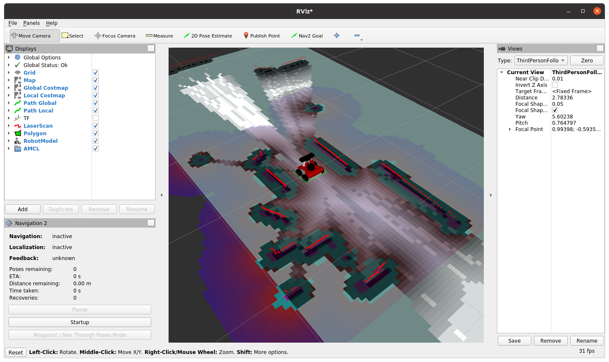
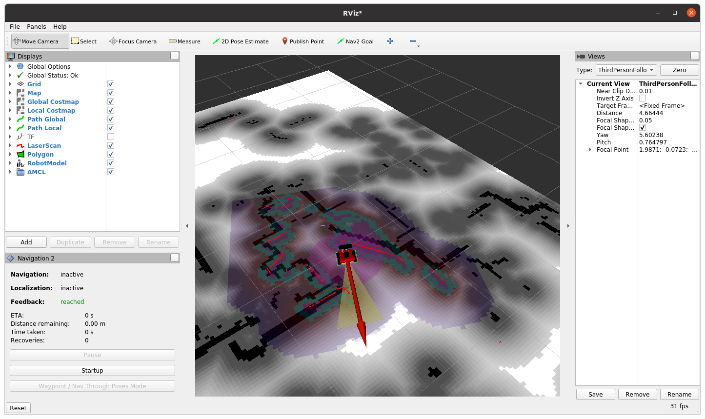

# Demo

Run autonomous mapping and navigation demo with ROSbot [Navigation2](https://navigation.ros.org/) and [Slam Toolbox](http://wiki.ros.org/slam_toolbox) in Docker. 

There are two phases:

1. **Creating a map** - navigation and creating a map by using [slam-toolbox](https://github.com/SteveMacenski/slam_toolbox)
2. **Localization on an already created map** - Navigation based on created map - with [AMCL](https://navigation.ros.org/configuration/packages/configuring-amcl.html)

Both cases are presented in three setups: 

1. In a Local Area Network (LAN) - the robot running navigation stack and PC / laptop running RViz are in the same Wi-Fi network.
2. Over the Internet (VPN) - the robot and the laptop can be in separate networks.
3. Gazebo simulation.

> **Prerequisites**
>
> Make sure you have [Docker and Docker-Compose](https://docs.docker.com/desktop/install/linux-install/) installed on your laptop. 
> 
> If you don't have, here's a quick summary for Ubuntu 20.04 (just click the `copy` button, and paste it to the Linux terminal):
> ```bash
> sudo apt-get update && sudo apt-get install -y ca-certificates curl gnupg lsb-release
> ```
> ```bash
> sudo mkdir -p /etc/apt/keyrings
> ```
> ```bash
> curl -fsSL https://download.docker.com/linux/ubuntu/gpg | sudo gpg --dearmor -o /etc/apt/keyrings/docker.gpg
> ```
> ```bash
> echo \
>  "deb [arch=$(dpkg --print-architecture) signed-by=/etc/apt/keyrings/docker.gpg] https://download.docker.com/linux/ubuntu \
>  $(lsb_release -cs) stable" | sudo tee /etc/apt/sources.list.d/docker.list > /dev/null
> ```
> ```bash
> sudo apt-get update && sudo apt-get install -y docker-ce docker-ce-cli containerd.io docker-compose-plugin
> ```
>
> Change `/var/run/docker.sock` permissions, so every user can can run docker commands without `sudo`:
> ```bash
> sudo chmod 666 /var/run/docker.sock
> ```

## Quick start (with a physical ROSbot)

### 1. Clone this repo **on your laptop**

```bash
git clone https://github.com/husarion/rosbot-docker/
```

### 2. Prepare `demo/.env` file

```bash
cd rosbot-docker/demo
cp .env.template .env
```

modify it if needed (see comments)

> **Warning**
>
> Make sure you have Docker Compose with at least `v2.3.0` version installed on your PC/laptop
>
> ```bash
> $ docker compose version
> Docker Compose version v2.3.3
> ```
>
> Inline comments in `.env` files are supported from this version

```bash
# ======================================================
# SBC <> STM32 serial connection.
# ======================================================

# SERIAL_PORT=/dev/ttyS4     # ROSbot 2 PRO
SERIAL_PORT=/dev/ttyAMA0   # ROSbbot 2R

# ======================================================
# Serial baudrate for rplidar driver
# ======================================================

RPLIDAR_BAUDRATE=115200     # RPLIDAR A2
# RPLIDAR_BAUDRATE=256000     # RPLIDAR A3

# ======================================================
# For simulation example you need to use simulation time
# ======================================================

USE_SIM_TIME=False      # for a physical ROSbot
# USE_SIM_TIME=True       # for a Gazebo simulation
```

If you have other ROS 2 devices running in your LAN network make sure to provide an unique `ROS_DOMAIN_ID` (the default value is `ROS_DOMAIN_ID=0`) and select the right `SERIAL_PORT` depending on your ROSbot version (ROSbot 2 / ROSbot 2 PRO / ROSbot 2R). Note that if you run the demo example in a **simulation** then `SERIAL_PORT` is ignored, but it is necessary to define the `USE_SIM_TIME` variable to `True`.

### 3. Sync your workspace with the ROSbot

> **Prerequisites**
>
> Install [unison](https://en.wikipedia.org/wiki/Unison_(software)), [inotify-tools](https://github.com/inotify-tools/inotify-tools/wiki) and [rsync](https://en.wikipedia.org/wiki/Rsync):
>
> ```bash
> sudo sudo apt-get update && sudo apt-get install -y unison inotify-tools rsync
> ```

In this project you will be asked to modify `.env` and `dds-config.xml` files. You need to have the same changes applied both on your robot and laptop/pc.

In the `demo/` folder, there is a script for auto-syncing of this repo with your ROSbot (so you can clone this repo only on your laptop).

If IP address of your robot in LAN is `10.5.10.64`, run (it uses `rsync` for synchronization):

```bash
./sync_with_rosbot.sh 10.5.10.64
```

> **Tip no. 1** 💡
>
> You can use Husarnet VPN hostname instead of IPv6 address

In order to allow changes on ROSbot to affect demo directory on your PC (for example for viewing saved map) use `--bidirectional` flag (it uses `unison` for that):

```bash
./sync_with_rosbot.sh 10.5.10.64 --bidirectional
```

### 4. Flash the microcontroller 

To flash the right firmware, open ROSbot's terminal or connect via `ssh` and execute this command:
   
- for differential drive (regular wheels):
   
```bash
docker run --rm -it --privileged \
husarion/rosbot:noetic \
/flash-firmware.py /root/firmware_diff.bin
```
- for omnidirectional wheeled ROSbot (mecanum wheels):

```bash
docker run --rm -it --privileged \
husarion/rosbot:noetic \
/flash-firmware.py /root/firmware_mecanum.bin
```

### 5. [Optional] VPN config

If in the next steps you want to run VPN configuration to make your system working **not only in LAN but also over the Internet** get your Husarnet Join Code and use it for connecting your ROSbot and laptop to the same Husarnet network. 

[Husarnet P2P VPN](https://husarnet.com/) is already preinstalled on your ROSbot. You need to install it on your laptop/pc as well. **Steps on how to connect ROSbot and your laptop to the same Husarnet network are described [here](https://husarion.com/tutorials/howtostart/rosbot2r-quick-start/#remote-access-over-the-internet-vpn)**. 

**Preparing `dds-config.xml` file:**

Default DDS discovery using multicasting doesn't work over VPN, therefore IPv6 addresses provided by Husarnet need to be applied to a peer list in a `dds-config.xml` file.

To do so, based on `dds-config.template.xml` file create the `dds-config.xml` file and paste Husarnet IPv6 address of your laptop and ROSbot here:

```xml
<initialPeersList>
    <locator>
        <udpv6>
            <address>replace-it-with-ipv6-addr-of-your-laptop</address>
        </udpv6>
    </locator>
    <locator>
        <udpv6>
            <address>replace-it-with-ipv6-addr-of-your-rosbot</address>
        </udpv6>
    </locator>
</initialPeersList>
```

> **Tip no. 2** 💡
>
> There is a simple utility script to generate `dds-config.xml` file for you by just providing Husarnet hostnames of your devices as arguments (if these hostnames are `mylaptop` and `myrosbot`):
> 
> ```bash
> ./dds-config-generate.sh mylaptop myrosbot
> ```

> **Tip no. 3** 💡
>
> FastDDS version preinstalled in ROS 2 Humble allows you to use Husarnet hostnames instead of IPv6 addresses.

### 6. Create a map

> **Tip no. 4** 💡
>
> **Enabling a display**
> 
> In order to use GUI of applications running in containers (like rviz) run:
> ``` bash
> xhost local:root
> ```
> on your PC, before starting the containers
>

Depending on the network configuration (LAN/VPN) execute the chosen pair of commands in the PC and ROSbot's terminal:

<table>

<!-- ------------------------------------------------- -->

<tr>

<th> </th> 
<th> ROSbot </th> 
<th> PC / laptop </th> 

</tr>

<!-- ------------------------------------------------- -->

<tr>

<td>
<b>LAN 🏠</b>
</td> 

<td>  


```bash
docker compose \
-f compose.rosbot.hardware.yaml \
-f compose.rosbot.mapping.yaml \
-f compose.rosbot.lan.yaml \
up
```

</td>

<td>  

```
docker compose \
-f compose.rviz.yaml \
-f compose.rviz.lan.yaml \
up
```

</td>

</tr>

<!-- ------------------------------------------------- -->

<tr>

<td> 
<b>VPN 🌎</b>
</td> 

<td>  

```bash
docker compose \
-f compose.rosbot.hardware.yaml \
-f compose.rosbot.mapping.yaml \
-f compose.rosbot.vpn.yaml \
up
```

</td>

<td>  


```
docker compose \
-f compose.rviz.yaml \
-f compose.rviz.vpn.yaml \
up
```

</td>

</tr>

<!-- ------------------------------------------------- -->

</table>

After about 35 seconds, you should see the ROSbot model in the Rviz window:



Prepare map with Rviz2 using the **[Nav2 Goal]** button on the top bar.

After you create the map, open a new terminal on ROSbot, navigate to `demo/` folder and execute:

```bash
./map-save.sh
```

Your map has been saved in docker volume and is available in the `maps/` folder.

Mapping phase is completed, you can stop / remove all running containers on ROSbot.

### 7. Localization on an already created map

Depending on the network configuration (LAN/VPN) execute the chosen pair of commands in the PC or ROSbot's terminal:

<table>

<!-- ------------------------------------------------- -->

<tr>

<th> </th> 
<th> ROSbot </th> 
<th> PC / laptop </th> 


</tr>

<!-- ------------------------------------------------- -->

<tr>

<td> 
<b>LAN 🏠</b>
</td> 

<td>  

```bash
docker compose \
-f compose.rosbot.hardware.yaml \
-f compose.rosbot.localization.yaml \
-f compose.rosbot.lan.yaml \
up
```

</td>

<td>  

```
docker compose \
-f compose.rviz.yaml \
-f compose.rviz.lan.yaml \
up
```

</td>

</tr>

<!-- ------------------------------------------------- -->

<tr>

<td> 
<b>VPN 🌎</b>
</td> 

<td>  

```bash
docker compose \
-f compose.rosbot.hardware.yaml \
-f compose.rosbot.localization.yaml \
-f compose.rosbot.vpn.yaml \
up
```

</td>

<td>  

```
docker compose \
-f compose.rviz.yaml \
-f compose.rviz.vpn.yaml \
up
```

</td>

</tr>

<!-- ------------------------------------------------- -->

</table>

After about 35 seconds, you should see the ROSbot model in the Rviz window in a random place on the map you have previously created:


By using the **[2D Pose Estimate]** button manualy tell the ROSbot where on the existing map is its starting position:



and tell the ROSbot where to go autonomously with **[Nav2 Goal]** button.

## Quick start (simulation model of ROSbot in Gazebo)

### 1. Clone this repo **on your laptop**

```bash
git clone https://github.com/husarion/rosbot-docker/
```

### 2. Prepare `demo/.env` file

```bash
cd rosbot-docker/demo
cp .env.template .env
```

modify it if needed (see comments)

```bash
# ======================================================
# SBC <> STM32 serial connection.
# ======================================================

# SERIAL_PORT=/dev/ttyS4     # ROSbot 2 PRO
SERIAL_PORT=/dev/ttyAMA0   # ROSbbot 2R

# ======================================================
# Serial baudrate for rplidar driver
# ======================================================

RPLIDAR_BAUDRATE=115200     # RPLIDAR A2
# RPLIDAR_BAUDRATE=256000     # RPLIDAR A3

# ======================================================
# For simulation example you need to use simulation time
# ======================================================

# USE_SIM_TIME=False      # for a physical ROSbot
USE_SIM_TIME=True       # for a Gazebo simulation
```

### 3. Create a map

On your PC with launch:

```bash
xhost local:root
```

```bash
docker compose \
-f compose.rosbot.simulation.yaml \
-f compose.rosbot.mapping.yaml \
-f compose.rviz.yaml \
up
```

In the Rviz2 window, click the **[Startup]** button in the "**Navigation 2**" field.

Prepare a map with Rviz2 by driving the ROSbot around using the **[Nav2 Goal]** button.

After you create the map, open a new terminal on ROSbot, navigate to `demo/` folder and execute:

```bash
./map-save.sh
```

### 4. Localization on an already created map

Next launch `Navigation2` stack with `AMLC`:

```bash
xhost local:root
```

```bash
docker compose \
-f compose.rosbot.simulation.yaml \
-f compose.rosbot.localization.yaml \
-f compose.rviz.yaml \
up 
```

By using the **[2D Pose Estimate]** button manualy tell the ROSbot where on the existing map is its starting position and tell the ROSbot where to go autonomously by using the **[Nav2 Goal]** button.

