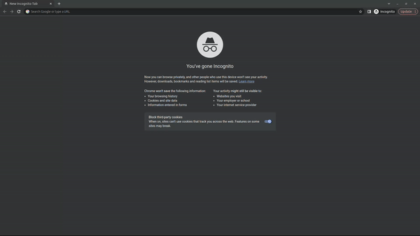

# rosbot-sensors
Visualization for all ROSbot sensors.

# Quick Start
## PC
Clone the repository:
```
git clone https://github.com/husarion/rosbot-docker
cd rosbot-docker
```

Sync workspace with ROSbot
```
./sync_with_rosbot.sh <ROSbot_ip>
```

Open web browser and go to `<ROSbot_ip>:8080` website (Chrome is recommended).

## ROSbot
In the ROSbot's shell execute (in the `/home/husarion/rosbot-docker/demo directory`)
```
docker compose -f compose.rosbot.yaml up
```

# Demo
Now reload the foxglove_sensors.png)website in your PC. You should see the Foxglove application. Click on left top button `Data source`, click the plus `new connection` -> `Open connection` and you should see `WebSocket URL` set to `ws://<ROSbot_ip>:9090` > `Open`
