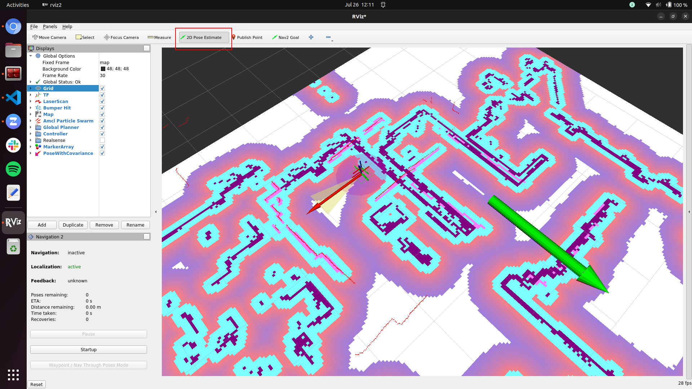

# Demos

These docker compose yaml configruations present how to run autonomous mapping and navigation with ROSbot and [Navigation2](https://navigation.ros.org/) stack. 

There are two phases:

1. Navigation and creating a map - by using [slam-toolbox](https://github.com/SteveMacenski/slam_toolbox)
2. Navigation based on created map - with [AMCL](https://navigation.ros.org/configuration/packages/configuring-amcl.html)

Both cases are presented below in three setups: 

1. In a Local Area Network (LAN) - robot running navigation stack and laptop running RViz are in the same Wi-Fi network
2. Over the Internet (VPN) - robot and laptop can be in separate networks.
3. Gazebo simulation

## Quick start (Physical ROSbot)

### 1. Clone this repo **on your laptop**

```bash
git clone https://github.com/husarion/rosbot-docker/
```

### 2. Prepare `demo/.env` file

```bash
cd rosbot-docker/demo
cp .env.template .env
```

modify it if needed (see comments)

```bash
# For LAN examples you need to have unique ROS_DOMAIN_ID to avoid reading messages from other robots in the network
ROS_DOMAIN_ID=228

# For simulation example you need to use simulation time
# Set:
# False    for running on a physical ROSbot
# True     for a Gazebo simulation
USE_SIM_TIME=False

# SBC <> STM32 serial connection. 
# Set:
# /dev/ttyS1    for ROSbot 2
# /dev/ttyS4    for ROSbot 2 PRO
# /dev/ttyAMA0  for ROSbbot 2R
SERIAL_PORT=/dev/ttyAMA0

# Serial baudrate for rplidar driver
# Set:
# 115200        for RPLIDAR A2  
# 256000        for RPLIDAR A3 
RPLIDAR_BAUDRATE=115200

# DDS implementation
# Set:
# rmw_cyclonedds_cpp    for Eclipse’s Cyclone DDS (currently the default)
# rmw_fastrtps_cpp      for eProsima’s Fast DDS (in progress)
RMW_IMPLEMENTATION=rmw_fastrtps_cpp

# Uncomment for compose.*.vpn.yaml files and paste your own Husarnet Join Code from app.husarnet.com here:
# JOINCODE=fc94:b01d:1803:8dd8:b293:5c7d:7639:932a/xxxxxxxxxxxxxxxxxxxxxx
```

If you have other ROS 2 devices running in your LAN network make sure to provide a unique `ROS_DOMAIN_ID` (the default value is `ROS_DOMAIN_ID=0`) and select the right `SERIAL_PORT` depending on your ROSbot version (ROSbot 2 / ROSbot 2 PRO / ROSbot 2R). Note that if you run the demo example in a **simulation** then `SERIAL_PORT` is ignored, but it is necessary to define the `USE_SIM_TIME` variable to `True`.

### 4. Sync your workspace with the ROSbot

In the `demo/` folder there is a script for auto-syncing this repo with ROSbot (you do not need to manually change the same repo on ROSbot and on laptop)

If IP address of your robot is `10.5.10.64`, run:

```bash
./sync_with_rosbot.sh 10.5.10.64
```

### 5. Flash the microcontroller 

To flash the right firmware, open ROSbot's terminal or connect via `ssh` and execute this command:
   
- for differential drive (regular wheels):
   
```bash
docker run --rm -it --privileged \
husarion/rosbot:noetic \
/flash-firmware.py /root/firmware_diff.bin
```
- for omnidirectional wheeled ROSbot (mecanum wheels):

```bash
docker run --rm -it --privileged \
husarion/rosbot:noetic \
/flash-firmware.py /root/firmware_mecanum.bin
```

### 7. [Optional] VPN config

If in the next steps you want to run VPN configuration get your Husarnet Join Code and paste it as a value for `JOINCODE` environment variable in the `.env` file.

You will find your **Husarnet Join Code** on your account at Husarnet Dashboard:

1. Log in to https://app.husarnet.com/
2. Select or create a network
3. Click **[Add element]** button and select a **Join Code** tab:

Execute these commands in the Linux terminal

```bash
./generate-vpn-config.sh
```

### 6. Create a map

<table>

<!-- ------------------------------------------------- -->

<tr>

<th> </th> 
<th> LAN </th> 
<th> VPN </th>

</tr>

<!-- ------------------------------------------------- -->

<tr>

<td> 
PC / laptop
</td> 

<td>  


```
docker compose \
-f compose.rviz.yaml \
-f compose.rviz.lan.yaml \
up
```

</td>

<td>  


```
docker compose \
-f compose.rviz.yaml \
-f compose.rviz.vpn.yaml \
up
```

</td>

</tr>

<!-- ------------------------------------------------- -->

<tr>

<td> 
ROSbot
</td> 

<td>  

```bash
docker compose \
-f compose.rosbot.hardware.yaml \
-f compose.rosbot.mapping.yaml \
-f compose.rosbot.lan.yaml \
up
```

</td>

<td>  


```bash
docker compose \
-f compose.rosbot.hardware.yaml \
-f compose.rosbot.mapping.yaml \
-f compose.rosbot.vpn.yaml \
up
```

</td>

</tr>

<!-- ------------------------------------------------- -->

</table>

Prepare map with Rviz2 using **2D Goal Pose**.


After you create the map, open a new terminal on ROSbot, navigate to `demo/` folder and execute:

```bash
./map-save.sh
```

Your map has been saved in docker volume and is now in the `maps/` folder.

### 7. Localization on an already created map

<table>

<!-- ------------------------------------------------- -->

<tr>

<th> </th> 
<th> LAN </th> 
<th> VPN </th>

</tr>

<!-- ------------------------------------------------- -->

<tr>

<td> 
PC / laptop
</td> 

<td>  


```
docker compose \
-f compose.rviz.yaml \
-f compose.rviz.lan.yaml \
up
```

</td>

<td>  

```
docker compose \
-f compose.rviz.yaml \
-f compose.rviz.vpn.yaml \
up
```

</td>

</tr>

<!-- ------------------------------------------------- -->

<tr>

<td> 
ROSbot
</td> 

<td>  

```bash
docker compose \
-f compose.rosbot.hardware.yaml \
-f compose.rosbot.localization.yaml \
-f compose.rosbot.lan.yaml \
up
```

</td>

<td>  


```bash
docker compose \
-f compose.rosbot.hardware.yaml \
-f compose.rosbot.localization.yaml \
-f compose.rosbot.vpn.yaml \
up
```

</td>

</tr>

<!-- ------------------------------------------------- -->

</table>

Set initial pose of ROSbot using `2D Pose Estimate` and navigate with `Nav2 Goal`.




<!-- ######################################################## -->
<!-- ######################################################## -->
<!-- ######################################################## -->
<!-- ######################################################## -->
<!-- ######################################################## -->
<!-- ######################################################## -->
<!-- ######################################################## -->

## Creating, Saving and Loading the Map with Gazebo (Simulation)

On your PC with [Nvidia-docker](https://docs.nvidia.com/datacenter/cloud-native/container-toolkit/install-guide.html) drivers launch:

```bash
xhost local:root
docker compose \
-f compose.rosbot.simulation.yaml \
-f compose.rosbot.mapping.yaml \
-f compose.rviz.yaml \
up
```
Prepare map with Rviz2 using 2D Goal Pose and [save the map](https://github.com/husarion/rosbot-docker/tree/ros1/demo#saving-the-map).

### Results:
[](
https://youtu.be/OiZTFYMlgis)

Next, see what the `compose.rviz.yaml` file should look like ([link](https://github.com/husarion/rosbot-docker/tree/ros1/demo#autonomus-localization:-control-rosbot-from-rviz-running-on-your-laptop-(amcl))) and launch `Navigation2` stack with `AMLC`:
```bash
xhost local:root
docker compose \
-f compose.rosbot.simulation.yaml \
-f compose.rosbot.localization.yaml \
-f compose.rviz.yaml \
up 
```

### Results:

[](https://www.youtube.com/watch?v=j_tRVuZiR18)

## Controlling ROSbot over the Internet (VPN)
1. Edit `demo/.env` file.
    
    Log in on your account at https://app.husarnet.com, create a new network, click the **[Add element]** button and copy the Join Code. Paste it in `.env` file as a value for `JOINCODE` environment variable. Do it both on ROSbot and on your PC i.e.:
    ```bash
    # for LAN examples you need to have unique ROS_DOMAIN_ID to avoid reading messages from other robots in the network
    ROS_DOMAIN_ID=228

    # for simulation example you need to use simulation time
    USE_SIM_TIME=False

    # SBC <> STM32 serial connection. Set:
    # /dev/ttyS1 for ROSbot 2
    # /dev/ttyS4 for ROSbot 2 PRO
    # /dev/ttyAMA0 for ROSbbot 2R
    SERIAL_PORT=/dev/ttyS4

    # Uncomment for compose.*.vpn.yaml files and paste your own Husarnet Join Code from app.husarnet.com here:
    JOINCODE=fc94:b01d:1803:8dd8:b293:5c7d:7639:932a/mVdwvA9oqtt5ahjmmGfF83
    ```

3. Generate DDS config files.

    In this example [Husarnet P2P VPN](https://husarnet.com/) is used for providing over the Internet connectivity. Default DDS discovery using multicasting doesn't work therefore. IPv6 addresses provided by Husarnet VPN need to be applied to a peer list in a `dds-config.xml` file. To do not copy those IPv6 addresses there is a simple utility script that does it for you. Everything you need to do is to launch it **ONLY ONCE** and copy **THE SAME** `secret/` folder to both devices:

    ```bash
    ./generate-vpn-config.sh
    ```

4. Copy the changes to your ROSbot, eg. with [`rsync`](https://linux.die.net/man/1/rsync). Assuming your ROSbot IP address is `192.168.8.186`, just execute:

    ```bash
    rsync -vRr ./ husarion@192.168.8.186:/home/husarion/rosbot-docker
    ```

5. Launch your compose files.